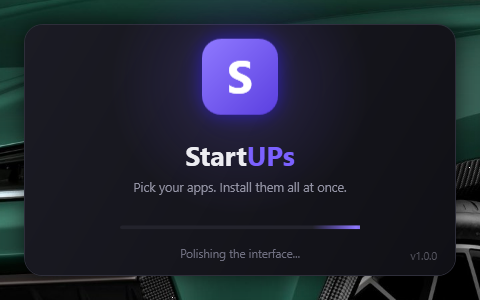

# StartUPs

**Pick your apps. Install them all at once.**

StartUPs is a Windows desktop app for people who just built or bought a new PC. Tick the apps you want from a categorised catalog, press one button, and it installs every one of them silently while you go do something else.


---

## Why it exists

Setting up a fresh Windows install means visiting a dozen websites, dodging the wrong download button, and clicking through a dozen installers. StartUPs collapses that into one screen and one click.

## Features

- **94 apps across 11 categories** — Gaming, Development, Browsers, Media, Utilities, Communication, Imaging, Documents, Security, Online Storage, Runtimes
- **Real icons for almost every app** — 87 of 94 carry the genuine brand mark
- **One UAC prompt for the whole batch** — not one per app
- **Live download progress** with a real transfer-speed readout
- **Skips what you already have** — checks each app before installing
- **Select Essentials** — one click ticks the 19 apps almost everyone wants
- **Instant search** across app names, descriptions, and package IDs
- **Cancel any time** — stops the current download and leaves the rest untouched
- **Built-in updater** — checks GitHub on request, verifies the download's checksum, and restarts into the new version
- **Single portable .exe** — no installer, no .NET runtime required



## Download

Grab `StartUPs.exe` from the [latest release](https://github.com/Distortionzz/StartUPs/releases). It is a single self-contained file — no installer, nothing to unzip.

On first run Windows SmartScreen will warn about an unrecognised app, because the executable is unsigned. Click **More info → Run anyway**.

## How it works

StartUPs never hosts or downloads installers itself. It drives [**winget**](https://learn.microsoft.com/windows/package-manager/), Microsoft's package manager built into Windows, which fetches each app from the vendor's own official URL and verifies its hash before running it.

```
Click Install
   |
   +-- UAC elevation prompt (once)
   |
   +-- Sequential queue, one app at a time:
   |     winget list    -> already installed? skip it
   |     winget install -> silent, progress parsed live
   |
   +-- Summary: installed / already present / cancelled / failed
```

Installs run one at a time because winget takes a machine-wide lock — parallel installs would simply fail.

## Requirements

- Windows 10 (1809+) or Windows 11
- winget, included with **App Installer** — preinstalled on Windows 11
- Administrator rights (StartUPs requests them at launch)

No .NET installation needed. The runtime is bundled inside the executable.

## Building from source

```
git clone https://github.com/Distortionzz/StartUPs.git
cd StartUPs
dotnet build
```

To produce the distributable single file:

```
dotnet publish StartUPs/StartUPs.csproj -c Release
```

The result lands in `StartUPs/bin/Release/net8.0-windows/win-x64/publish/StartUPs.exe` — around 69 MB, self-contained and compressed.

## Adding an app to the catalog

The catalog is plain data, so adding apps needs no code changes. Edit [`StartUPs/catalog.json`](StartUPs/catalog.json) and add an entry under the category you want:

```json
{
  "wingetId": "Valve.Steam",
  "name": "Steam",
  "description": "The biggest PC game store and library.",
  "essential": true
}
```

Find the right `wingetId` with:

```
winget search "app name"
```

Confirm it resolves exactly before adding it:

```
winget search --id Valve.Steam --exact
```

Set `essential` to `true` to include the app in the **Select Essentials** one-click preset. The file is embedded into the executable at build time, so rebuild after editing.

## Project layout

```
StartUPs/
  StartUPs.sln
  docs/                      screenshots
  StartUPs/
    catalog.json             the app catalog (embedded at build time)
    icons.json               vector brand glyphs, keyed by winget ID
    Assets/AppIcons/         PNG icons for apps with no vector glyph
    Models/                  AppEntry, Catalog, InstallState
    Services/
      CatalogService.cs      loads the embedded catalog
      IconService.cs         resolves each app's icon
      WingetService.cs       runs winget, parses live progress
    Theme.xaml               dark palette and control styles
    SplashWindow.xaml(.cs)   animated startup splash
    MainWindow.xaml(.cs)     layout, filtering, install queue
    app.manifest             requests administrator at launch
    icon.ico                 app icon, 7 sizes
```

## App icons

87 of the 94 apps show their genuine icon, from one of two sources:

- **56 apps** use vector brand glyphs from [Simple Icons](https://simpleicons.org/), stored as raw path data in `icons.json` and rendered natively by WPF. They stay crisp at any size and cost about 65 KB of path data in total.
- **31 apps** with no brand glyph — mostly niche utilities such as HWiNFO, GPU-Z and Everything — ship as PNGs extracted from their official installers at 128x128.

The remaining **7** fall back to a generated letter tile, coloured deterministically so an app always looks the same. This is deliberate rather than a gap: their installers ship only the generic Inno Setup or Windows Installer icon, and a stock monitor graphic reads as broken in a way the letter tile does not. Getting real marks for WinMerge, MediaMonkey, WizTree, IrfanView and KeePass would need `innoextract` to unpack the Inno payload; the two VC++ Redistributables have no brand mark to find.

Simple Icons has removed the Adobe, Microsoft, Amazon and Java marks following trademark requests, so those apps use extracted PNGs instead.

Brand colours that are close to black are automatically swapped for a light substitute, so marks like Steam's stay visible against the dark theme.

Simple Icons is CC0; the brand marks themselves remain trademarks of their respective owners.

## Known limitations

- **SmartScreen warning.** The executable is unsigned, so Windows shows "Windows protected your PC" on first run. Click *More info -> Run anyway*. Removing this requires a paid code-signing certificate.
- **Startup takes a few seconds.** The single-file build compresses the whole .NET runtime into one executable, and Windows must unpack it before any code runs — roughly 3 seconds warm, longer on a first run. The splash screen only appears after that, so it cannot cover it. Turning off `EnableCompressionInSingleFile` would roughly halve the wait at the cost of doubling the file size.
- **Progress covers downloading only.** Once a file is downloaded, winget hands off to the vendor's own installer, which reports no progress — the bar sits at 100% showing "Installing..." until it finishes.
- **Microsoft Store apps excluded.** Apps that exist only in the Store (NVIDIA App, WhatsApp, MusicBee) are left out of the catalog because Store packages do not reliably install silently.
- **A few apps have no winget package at all.** FileZilla, for instance, is absent from the winget source entirely, so it cannot be offered no matter how popular it is.
- **Upstream packages can break.** A winget manifest points at the vendor's own URL and pins the installer's hash, so a vendor who silently replaces a file breaks the package for everyone until the manifest is updated. AIMP (hash mismatch) and RealVNC Viewer (dead URL) were both dropped from the catalog for this reason — winget correctly refuses to install either.

## Licence

StartUPs is released under the [MIT Licence](LICENSE) — free to use, modify and redistribute, including commercially, provided the copyright notice is kept.

This covers **StartUPs' own source code only**. It does not extend to:

- The applications in the catalog, each governed by its own licence
- Brand names, logos and trademarks, which remain the property of their owners
- Icons extracted from third-party installers, which remain the property of those vendors

## Policies

- [Privacy Policy](PRIVACY.md) — StartUPs collects nothing; what winget contacts and why
- [Terms of Use](TERMS.md) — no warranty, third-party licences, and how package agreements are accepted
- [Security Policy](SECURITY.md) — how to report a vulnerability, the security model, verifying your download

## Built with

- C# / .NET 8 / WPF
- winget (Windows Package Manager)

## Icon


