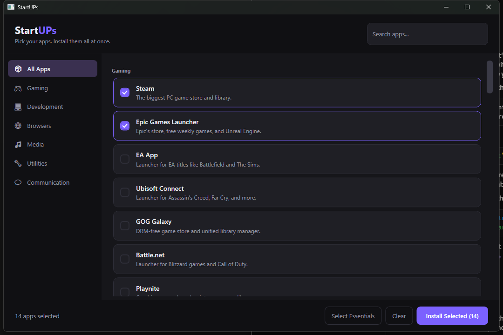
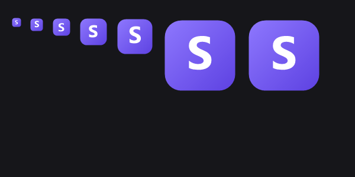

# StartUPs

**Pick your apps. Install them all at once.**

StartUPs is a Windows desktop app for people who just built or bought a new PC. Tick the apps you want from a categorised catalog, press one button, and it installs every one of them silently while you go do something else.



---

## Why it exists

Setting up a fresh Windows install means visiting a dozen websites, dodging the wrong download button, and clicking through a dozen installers. StartUPs collapses that into one screen and one click.

## Features

- **48 apps across 6 categories** — Gaming, Development, Browsers, Media, Utilities, Communication
- **One UAC prompt for the whole batch** — not one per app
- **Live download progress** with a real transfer-speed readout
- **Skips what you already have** — checks each app before installing
- **Select Essentials** — one click ticks the 14 apps almost everyone wants
- **Instant search** across app names, descriptions, and package IDs
- **Cancel any time** — stops the current download and leaves the rest untouched
- **Single portable .exe** — no installer, no .NET runtime required

## How it works

StartUPs never hosts or downloads installers itself. It drives [**winget**](https://learn.microsoft.com/windows/package-manager/), Microsoft's package manager built into Windows, which fetches each app from the vendor's own official URL and verifies its hash before running it.

```
Click Install
   |
   +-- UAC elevation prompt (once)
   |
   +-- Sequential queue, one app at a time:
   |     winget list    -> already installed? skip it
   |     winget install -> silent, progress parsed live
   |
   +-- Summary: installed / already present / cancelled / failed
```

Installs run one at a time because winget takes a machine-wide lock — parallel installs would simply fail.

## Requirements

- Windows 10 (1809+) or Windows 11
- winget, included with **App Installer** — preinstalled on Windows 11
- Administrator rights (StartUPs requests them at launch)

No .NET installation needed. The runtime is bundled inside the executable.

## Building from source

```
git clone https://github.com/Distortionzz/StartUPs.git
cd StartUPs
dotnet build
```

To produce the distributable single file:

```
dotnet publish StartUPs/StartUPs.csproj -c Release
```

The result lands in `StartUPs/bin/Release/net8.0-windows/win-x64/publish/StartUPs.exe` — around 69 MB, self-contained and compressed.

## Adding an app to the catalog

The catalog is plain data, so adding apps needs no code changes. Edit [`StartUPs/catalog.json`](StartUPs/catalog.json) and add an entry under the category you want:

```json
{
  "wingetId": "Valve.Steam",
  "name": "Steam",
  "description": "The biggest PC game store and library.",
  "essential": true
}
```

Find the right `wingetId` with:

```
winget search "app name"
```

Confirm it resolves exactly before adding it:

```
winget search --id Valve.Steam --exact
```

Set `essential` to `true` to include the app in the **Select Essentials** one-click preset. The file is embedded into the executable at build time, so rebuild after editing.

## Project layout

```
StartUPs/
  StartUPs.sln
  docs/                      screenshots
  StartUPs/
    catalog.json             the app catalog (embedded at build time)
    Models/                  AppEntry, Catalog, InstallState
    Services/
      CatalogService.cs      loads the embedded catalog
      WingetService.cs       runs winget, parses live progress
    Theme.xaml               dark palette and control styles
    MainWindow.xaml(.cs)     layout, filtering, install queue
    app.manifest             requests administrator at launch
    icon.ico                 app icon, 7 sizes
```

## Known limitations

- **SmartScreen warning.** The executable is unsigned, so Windows shows "Windows protected your PC" on first run. Click *More info -> Run anyway*. Removing this requires a paid code-signing certificate.
- **Progress covers downloading only.** Once a file is downloaded, winget hands off to the vendor's own installer, which reports no progress — the bar sits at 100% showing "Installing..." until it finishes.
- **Microsoft Store apps excluded.** Apps that exist only in the Store (NVIDIA App, WhatsApp) are left out of the catalog because Store packages do not reliably install silently.

## Built with

- C# / .NET 8 / WPF
- winget (Windows Package Manager)

## Icon


